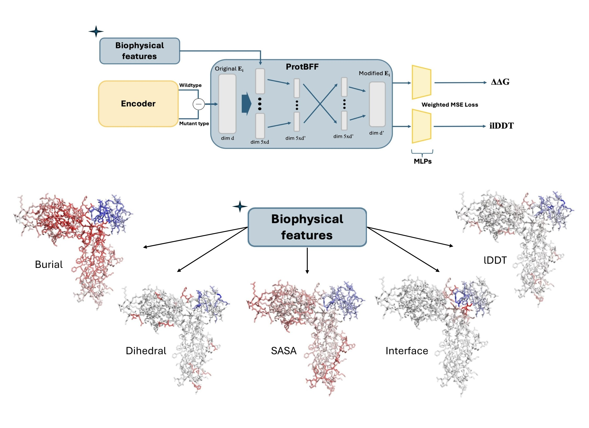

# ProtBFF: Biophysically Grounded Deep Learning for Protein–Protein ΔΔG Prediction

<p align="center">
  <em>Feldman, Maechler, Wang & Shakhnovich — Cold Spring Harbor Laboratory, 2025</em>
</p>

---

> **ProtBFF** (**Prot**ein **B**iophysical **F**eature **F**ramework) is an encoder-agnostic module that injects five interpretable biophysical priors into residue-level representations via cross-embedding attention — consistently improving ΔΔG prediction under rigorous homology-based evaluation.

---

## Overview



---

## Installation

**1. Clone the repository**

```bash
git clone https://github.com/Jfeldman34/ProtBFF.git
cd ProtBFF
```

**2. Set up the environment**

Conda with Python 3.10 is recommended:

```bash
conda create -n protbff python=3.10
conda activate protbff
pip install -r requirements.txt
```

---

## Benchmarking

### SKEMPI (ProSST + ProtBFF)

To run the SKEMPI benchmark with the ProSST + ProtBFF model:

```bash
python evaluate_saved_models.py \
    --cache model_benchmarking/score_caches/skempi_score_cache.npz \
    --model_save_dir model_benchmarking/skempi_prosst_output/ \
    --folds_dir data/cross_validation_folds_final \
    --output_dir "."
```

### Antibody Benchmarks (ProSST + ProtBFF)

**9LYP**

```bash
python antibodies_protbff_benchmarking.py \
    --prosst_model_dir model_benchmarking/9lyp_comparison_output \
    --prosst_cache_path model_benchmarking/score_caches/9lyp_score_cache.npz \
    --esm2_model_dir model_benchmarking/9lyp_esm2_cross_attn_output/ \
    --esm2_cache_path model_benchmarking/score_caches/9lyp_esm_score_cache.npz \
    --output_dir . \
    --random_seed 42
```

**7W9I**

```bash
python antibodies_protbff_benchmarking.py \
    --prosst_model_dir model_benchmarking/7w9i_comparison_output \
    --prosst_cache_path model_benchmarking/score_caches/ace2_score_cache.npz \
    --esm2_model_dir model_benchmarking/few_shot_esm2_cross_attn_output/ \
    --esm2_cache_path model_benchmarking/score_caches/ace2_esm_score_cache.npz \
    --output_dir . \
    --random_seed 42
```

Model architectures are contained in the relevant benchmarking scripts.

---

## Regenerating Biophysical Scores and Embeddings from Scratch

If you want to regenerate the full data pipeline rather than using the precomputed score caches, follow the steps below.

### Step 1 — Tokenize PDB Structures

PDB structures are located in the `/data` folder.

```bash
OPT_OUT=data/optimized_tokens_2048
WT_OUT=data/wildtype_tokens_2048

mkdir -p $OPT_OUT
mkdir -p $WT_OUT

# Tokenize optimized structures
python tokenize_pdb_full.py \
    --pdb-dir data/optimized/ \
    --output-dir $OPT_OUT \
    > $OPT_OUT/tokenize.log 2>&1

# Tokenize wildtype structures
python tokenize_pdb_full.py \
    --pdb-dir data/wildtype/ \
    --output-dir $WT_OUT \
    > $WT_OUT/tokenize_second_time.log 2>&1
```

### Step 2 — Embed Structures and Sequences

```bash
mkdir -p data/optimized_embeddings_2048
mkdir -p data/wildtype_embeddings_2048

# Embed optimized structures
python embedding_pdb_full.py \
    --token-dir data/optimized_tokens_2048 \
    --pdb-dir data/optimized/ \
    --output-dir data/optimized_embeddings_2048

# Embed wildtype structures
python embedding_pdb_full.py \
    --token-dir data/wildtype_tokens_2048 \
    --pdb-dir data/SKEMPI2/SKEMPI2_cache/wildtype \
    --output-dir data/wildtype_embeddings_2048
```

### Step 3 — Calculate All Biophysical Scores

```bash
OUTPUT_DIR=data/merged_output
LOG_FILE=$OUTPUT_DIR/pipeline_$(date +%Y%m%d_%H%M%S).log
mkdir -p $OUTPUT_DIR

python data_pipeline/calculate_all_scores.py \
    --csv data/SKEMPI2_filtered_final.csv \
    --pdb_wt_dir data/wildtype/ \
    --pdb_opt_dir data/optimized/ \
    --ost_json_dir data/lddt_dir/ \
    --wt_embedding_dir data/wildtype_embeddings_2048/ \
    --opt_embedding_dir data/optimized_embeddings_2048/ \
    --output_dir $OUTPUT_DIR \
    --temp_dir data/.temp_scores \
    --n_workers 64
```

### Step 4 — Merge Scores into a Cache

```bash
python merge_scores.py \
    --merged_dir $OUTPUT_DIR \
    --output_cache skempi_preprocessed_data.npz
```

Your final score cache will be saved as `skempi_preprocessed_data.npz` and can be passed directly to the benchmarking scripts.

---

## Extending to Custom Datasets

This pipeline can be applied to any dataset. You will need:

- Wildtype and mutant (optimized) protein structures, generated via [FoldX](http://foldxsuite.crg.eu/) or another relaxation method of your choice.
- If regenerating lDDT scores from scratch, the [OpenStructure](https://openstructure.org/) package is required.

All individual score calculation scripts are located in `data_pipeline/scores/`. Note that `merge_scores.py` is critical, as it handles normalization of several of the scores.

---

## Citation

If you use ProtBFF in your work, please cite:

```bibtex
@article{Feldman2025.12.23.696257,
  author    = {Feldman, Jonathan and Maechler, Antoine and Wang, Dianzhuo and Shakhnovich, Eugene},
  title     = {Biophysically Grounded Deep Learning Improves Protein--Protein {$\Delta\Delta G$} Prediction},
  journal   = {bioRxiv},
  year      = {2025},
  doi       = {10.64898/2025.12.23.696257},
  url       = {https://www.biorxiv.org/content/early/2025/12/25/2025.12.23.696257},
  publisher = {Cold Spring Harbor Laboratory}
}
```
